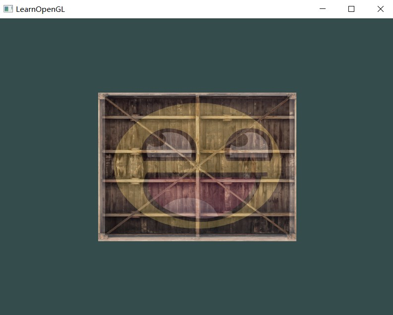
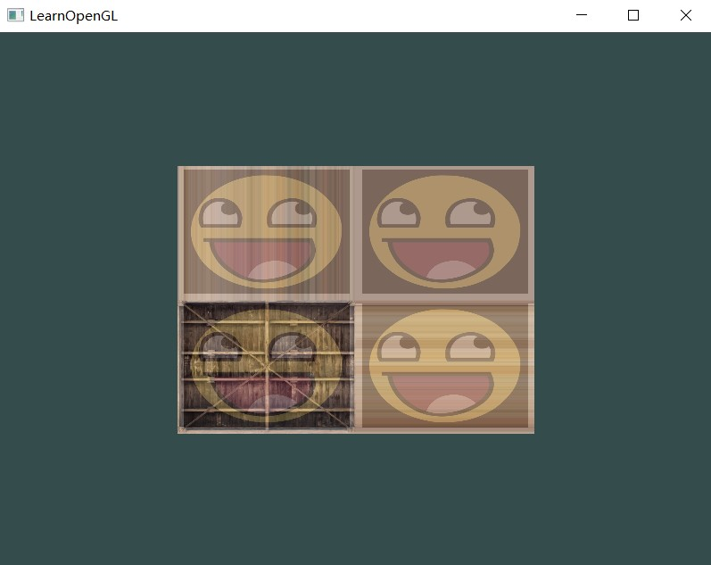
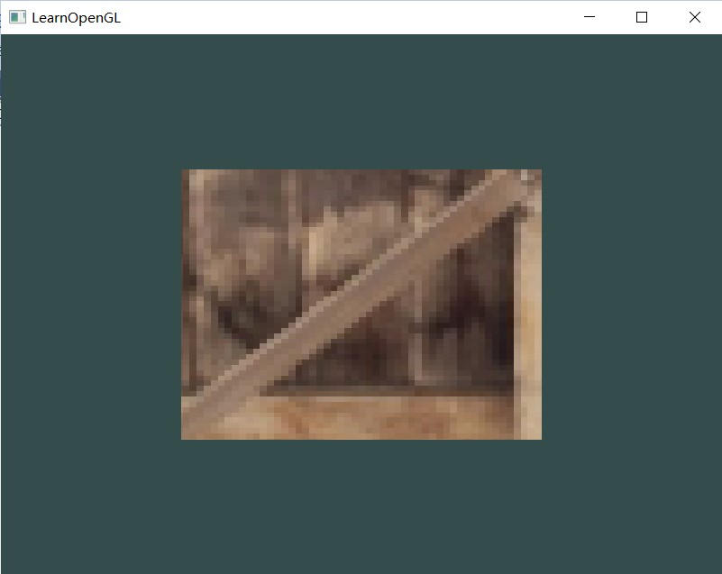
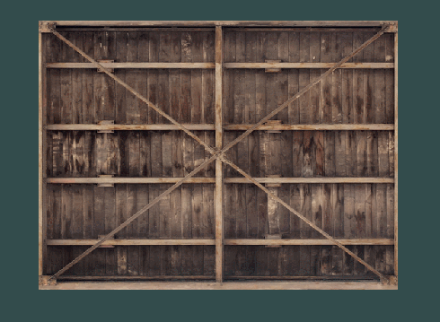

**1、修改片段着色器，仅让笑脸图案朝另一个方向看**

在片段着色器中修改输出为
```c++
FragColor = mix(texture(texture1, TexCoord), texture(texture2, TexCoord * vec2(-1, 1)), 0.2);

```

**2、尝试用不同的纹理环绕方式，设定一个从`0.0f`到`2.0f`范围内的（而不是原来的`0.0f`到`1.0f`）纹理坐标。试试看能不能在箱子的角落放置4个笑脸。记得一定要试试其它的环绕方式。**

修改片元着色器的输出
```c++
FragColor = mix(texture(texture1, TexCoord * 2), texture(texture2, TexCoord * 2), 0.2);
```
回到main.cpp，修改木箱纹理（texture1）的环绕方式
```c++
glTexParameteri(GL_TEXTURE_2D, GL_TEXTURE_WRAP_S, GL_CLAMP_TO_EDGE);	// set texture wrapping to GL_REPEAT (default wrapping method)
glTexParameteri(GL_TEXTURE_2D, GL_TEXTURE_WRAP_T, GL_CLAMP_TO_EDGE);
```


**3、尝试在矩形上只显示纹理图像的中间一部分，修改纹理坐标，达到能看见单个的像素的效果。尝试使用GL_NEAREST的纹理过滤方式让像素显示得更清晰。**

修改片元着色器，变换uv坐标
```c++
FragColor = texture(texture1, TexCoord * 0.1 + 0.4);
```
修改纹理（texture1）过滤方式

```c++
glTexParameteri(GL_TEXTURE_2D, GL_TEXTURE_MIN_FILTER, GL_NEAREST);
glTexParameteri(GL_TEXTURE_2D, GL_TEXTURE_MAG_FILTER, GL_NEAREST);
```



**4、使用一个uniform变量作为mix函数的第三个参数来改变两个纹理可见度，使用上和下键来改变箱子或笑脸的可见度**

修改片元着色器，添加全局变量
```c++
uniform float opacity;
```
>一开始我把类型写成了vec1，报错了。

将输出中的的mix函数的第三个参数从0.2改为该变量
```c++
FragColor = mix(texture(texture1, TexCoord), texture(texture2, TexCoord), opacity);
```
回到main.cpp，在main函数外添加全局变量
```c++
float opacity = 0.2f;
```
在void processInput(GLFWwindow* window)函数中添加按键响应
```c++
if (glfwGetKey(window, GLFW_KEY_UP) == GLFW_PRESS)
    {
        opacity += 0.001f; // change this value accordingly (might be too slow or too fast based on system hardware)
        if (opacity >= 1.0f)
            opacity = 1.0f;
    }
    if (glfwGetKey(window, GLFW_KEY_DOWN) == GLFW_PRESS)
    {
        opacity -= 0.001f; // change this value accordingly (might be too slow or too fast based on system hardware)
        if (opacity <= 0.0f)
            opacity = 0.0f;
    }
```
在while循环中、ourShader.use();上方，设置变量
```c++
// set the texture mix value in the shader
        ourShader.setFloat("opacity", opacity);
```

